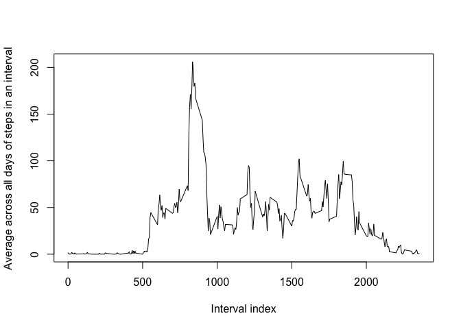

# Course Project 1
by willeslewis

This project will demonstrate to use of knitr to create a report.


## Load the data

In this step I don't do any preprocessing of the data.


```r
library(xtable)

##Get current directory
workdir<-getwd()

##Make a directory to hold the data if there isn't already one.
if(!dir.exists(paste(workdir,"/data",sep=""))){
        dir.create(paste(workdir,"/data",sep=""))
}

##Download the zip file and extract it to the data folder if for some reason it is not already in the working directory or if the data is not already extracted. Also read the data into R.
if(!file.exists("activity.zip") || !file.exists("data/activity.csv")){
        fileUrl<- "https://d396qusza40orc.cloudfront.net/repdata%2Fdata%2Factivity.zip";
        temp <- tempfile();
        download.file(fileUrl,temp,method="curl");
        unzip(temp,"activity.csv",exdir="data");
        unlink(temp);
}

mydata<- read.csv("data/activity.csv");
```

## What is mean total number of steps taken per day?

First I show a coarse histogram of the number of daily steps taken to get a sense of the distribution. To do this, tapply the sum function to the number of steps splitting over each date. NAs are ignored by the histogram. The default breaks value gives a decent sense of the distribution structure.

```r
        dailysteps<-tapply(mydata$steps,mydata$date,sum)
        hist(dailysteps)
```

<!-- -->

Now I calculate the mean and median of number of steps taken daily


```r
        mean(dailysteps,na.rm=TRUE)
```

[1] 10766.19

```r
        median(dailysteps,na.rm=TRUE)
```

[1] 10765

## What is the average daily activity pattern?

Here I plot the average across all days of the steps in a given 5-minute interval.


```r
        intfact<-as.factor(unique(mydata$interval))
        intsplit<-split(mydata$steps,intfact)
        avgintsteps<-sapply(intsplit,mean,na.rm=TRUE)
        plot(unique(mydata$interval),avgintsteps,type="l",xlab="Interval index",ylab="Average across all days of steps in an interval")
```

<!-- -->

Now, which interval has the maximum number of steps?


```r
        names(avgintsteps)[which.max(avgintsteps)]
```

[1] "835"

## Imputing missing values

Now let's see how many missing values there are:


```r
        sum(!complete.cases(mydata))
```

[1] 2304

How should we fill in the missing values? I will fill in a value with its 5-minute interval average across all days and create a new dataset with the NAs filled.

```r
        filldat<-mydata 
        missingint<-as.factor(filldat$interval[!complete.cases(mydata)])
        fillvec<-vector(mode="numeric",length=length(missingint))
        for(i in 1:length(fillvec)){
                fillvec[i]<-avgintsteps[which(missingint[i]==names(avgintsteps))]
                
        }

        filldat$steps[!complete.cases(mydata)]<-fillvec
```

Now I will replot the histogram of daily steps taken with the new data set.


```r
        filldailysteps<-tapply(filldat$steps,filldat$date,sum)
        hist(filldailysteps)
```

<!-- -->

Note that the histogram frequencies have changed a bit, this is because we now have a few more data points in each bin from filling in NAs as described above.

Now I also calculate the mean and median of the filled data. Note that the mean stays fixed, while, perhaps not too surprisingly, the median now matches the mean.


```r
        mean(filldailysteps)
```

[1] 10766.19

```r
        median(filldailysteps)
```

[1] 10766.19

Thus, for the given method of imputing, the average number of daily steps does not change while the median is slightly affected. In otherwords, there is very little effect on our estimate of total number of daily steps.

## Are there differences in activity patterns between weekdays and weekends?

To start I will now convert the date in the data to an actual date object so that I may get the corresponding day of the week. Then I will create a factor variable with two levels and labels of weekday and weekend. Then I'll plot average steps in an interval for each case.


```r
        filldat$date<-as.Date(filldat$date)
        weekdayslab <- c('Monday', 'Tuesday', 'Wednesday', 'Thursday', 'Friday')
        filldat$weekday <- factor((weekdays(filldat$date) %in% weekdayslab),levels=c(FALSE, TRUE), labels=c('weekend', 'weekday'))
        weekdaysplit<-split(filldat$steps,list(filldat$weekday,intfact))
        avgweeksteps<-sapply(weekdaysplit,mean)
       
        weekend<-avgweeksteps[grepl("weekend",names(avgweeksteps))]
        weekday<-avgweeksteps[grepl("weekday",names(avgweeksteps))]
        par(mfrow=c(2,1))
        plot(unique(filldat$interval),weekday,type="l",xlab="Interval index",ylab="Number of steps",main="Weekday")
        plot(unique(filldat$interval),weekend,type="l",xlab="Interval index",ylab="Number of steps",main="Weekend")
```

<!-- -->

From this, one may notice that the weekend seems to start slower (i.e. at a later time) on average. Additionally, activity as measured by steps is more uniform throughout the weekend and appears to last until later.
